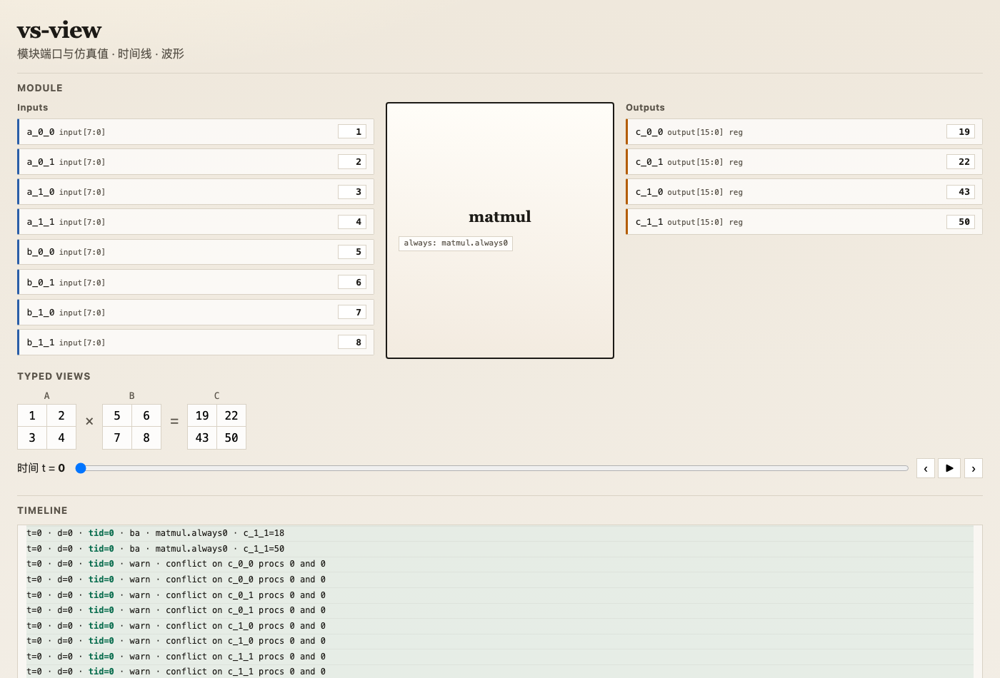
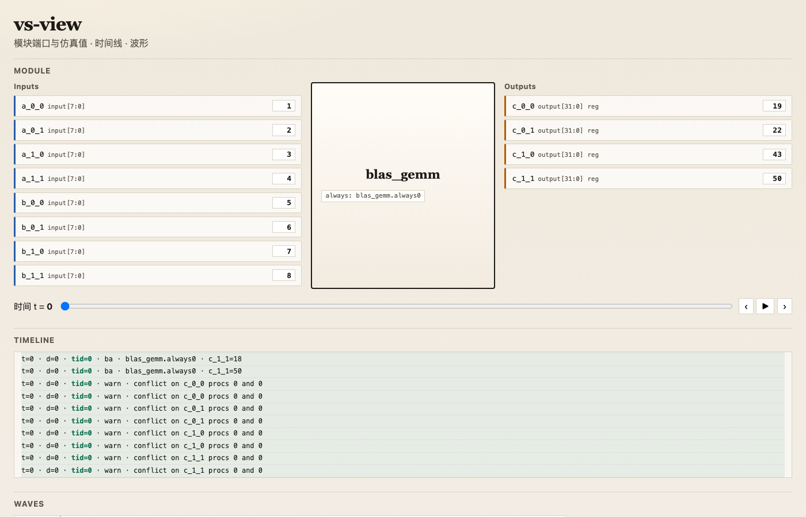
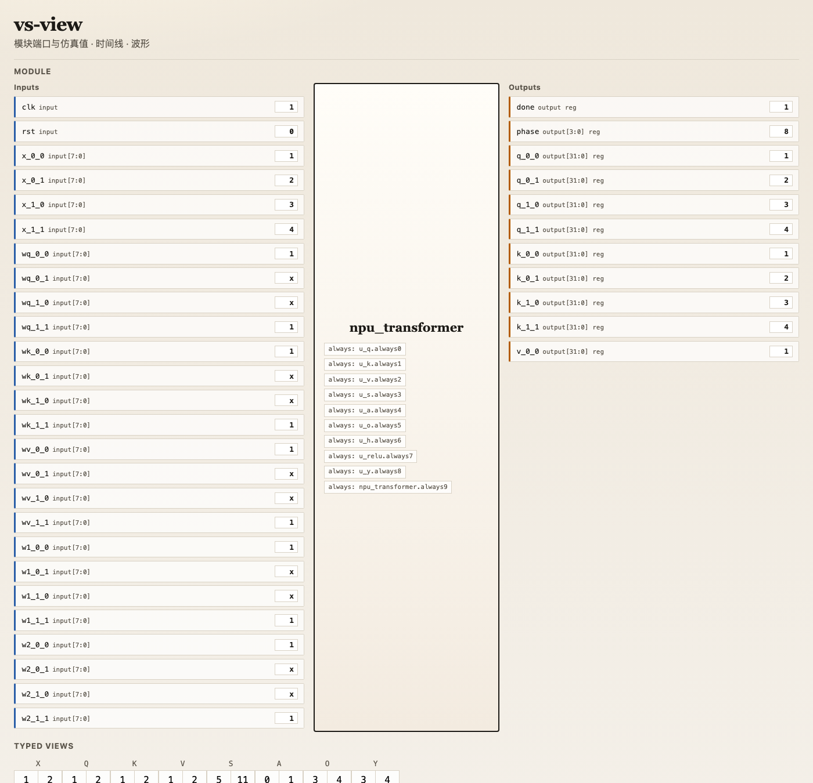
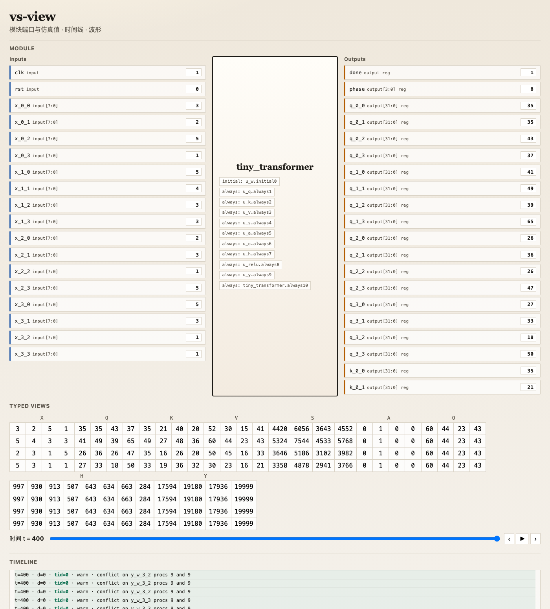

# vs — Verilog Simulator

从零实现的 **Verilog 模拟器**（解释执行、事件驱动），程序名为 **`vs`**。

不仅能跑计数器 / ALU，还能用 **RTL 级 GEMM、注意力与 FFN** 搭出可观察的玩具 **NPU Transformer**，并在 **vs-view** 里用矩阵 Typed Views 核对结果。

代理约束：[`AGENTS.md`](AGENTS.md)、[`CLAUDE.md`](CLAUDE.md)。示例在 [`examples/`](examples/)。

## 当前能力（亮点）

| 能力 | 说明 | 入口 |
|------|------|------|
| **硬件风格 GEMM** | 组合 `always @*` + `parameter`/`for`/2D 数组；`C=A·B` | [`examples/blas/gemm.v`](examples/blas/gemm.v)、[`examples/matmul.v`](examples/matmul.v) |
| **BLAS 叶子库** | `gemm` / `gemm_bt` / `relu` / `row_argmax`，可被顶层实例化 | [`examples/blas/`](examples/blas/) |
| **玩具 NPU** | 时序 FSM + 硬注意力 Transformer 层，多文件实例化 BLAS | [`examples/npu_transformer.v`](examples/npu_transformer.v) |
| **Tiny NPU** | T=D=4 / HF=8 端到端 + GEMM/MLP/Attn 拆分 demo，固定种子权重 | [`examples/tiny_npu/`](examples/tiny_npu/) |
| **GPT-2 × NPU tile** | Host 跑完整 GPT-2；`vs` 跑 layer0 `c_fc` 真实 int8 GEMM tile | [`examples/gpt2_npu/`](examples/gpt2_npu/) |
| **模块实例化** | 命名端口、参数覆盖；elab 展平；`vs run a.v b.v…` | 见 [`docs/grammar-v0.1.md`](docs/grammar-v0.1.md) |
| **vs-view** | 端口板 + 矩阵 Typed Views + 时间线 / 波形 | [`tools/vs-view`](tools/vs-view) |

另有：P0 flex+bison 解析、P2-lite 多线程事件仿真、`JSONL` trace、`// @vs` 注解。

### GEMM（矩阵乘）

`[[1,2],[3,4]] × [[5,6],[7,8]] = [[19,22],[43,50]]` — Typed Views 直接显示矩阵：



独立 BLAS 叶子 `blas_gemm`（同公式，输出 32-bit）：



### 玩具 NPU Transformer

实例化 `u_q`/`u_k`/`u_v`（GEMM）、`u_s`（GEMMᵀ）、`u_a`（row argmax）、`u_relu` 等；跑完 `done=1`，`Y=[[3,4],[3,4]]`：



### Tiny NPU（T=4, D=4, HF=8）

固定种子量化权重 + 硬注意力；跑完 `done=1`，`Y` 四行同为 `[17594, 19180, 17936, 19999]`（拆分 demo 见 [`examples/tiny_npu/`](examples/tiny_npu/)）：



### GPT-2 × NPU GEMM tile

完整 **GPT-2 (124M)** 在 Host（HuggingFace）前向；导出 layer0 `mlp.c_fc` 的真实激活/权重 tile（默认 4×32×32，对称 int8），在 `vs` 里用 `blas_gemm` 算 int32 结果并与 golden 对齐。详见 [`examples/gpt2_npu/`](examples/gpt2_npu/) 与 [`docs/superpowers/specs/2026-09-26-gpt2-npu-tile-design.md`](docs/superpowers/specs/2026-09-26-gpt2-npu-tile-design.md)。

## 依赖

- CMake ≥ 3.16、C11、flex、**bison ≥ 3.0**（macOS：`brew install bison`）
- 可视化：Node.js ≥ 18、npm（TypeScript）

```bash
brew install bison   # macOS
```

## 快速开始

```bash
cmake -B build -DCMAKE_BUILD_TYPE=Debug
cmake --build build
ctest --test-dir build --output-on-failure

# 计数器
./build/vs run examples/counter.v \
  --threads 4 --until 200 --clock clk=10 --reset rst=20 \
  --watch q,clk,rst --trace build/trace.jsonl
```

### 硬件 GEMM

```bash
# BLAS 叶子（顶层即 blas_gemm）
./build/vs run examples/blas/gemm.v --threads 1 --until 40 \
  --force a_0_0=1 --force a_0_1=2 --force a_1_0=3 --force a_1_1=4 \
  --force b_0_0=5 --force b_0_1=6 --force b_1_0=7 --force b_1_1=8 \
  --watch c_0_0,c_0_1,c_1_0,c_1_1 --trace build/trace_blas_gemm.jsonl
# 期望: 19 22 43 50

# 参数化 matmul（带 @vs 矩阵板）
./build/vs run examples/matmul.v --threads 1 --until 40 \
  --force a_0_0=1 --force a_0_1=2 --force a_1_0=3 --force a_1_1=4 \
  --force b_0_0=5 --force b_0_1=6 --force b_1_0=7 --force b_1_1=8 \
  --watch c_0_0,c_0_1,c_1_0,c_1_1 --trace build/trace_matmul_param.jsonl
```

### 玩具 NPU（多文件：顶层 + BLAS）

```bash
./build/vs run examples/npu_transformer.v \
  examples/blas/gemm.v examples/blas/gemm_bt.v \
  examples/blas/relu.v examples/blas/row_argmax.v \
  --threads 1 --until 400 --clock clk=10 --reset rst=20 \
  --force x_0_0=1 --force x_0_1=2 --force x_1_0=3 --force x_1_1=4 \
  --force wq_0_0=1 --force wq_0_1=0 --force wq_1_0=0 --force wq_1_1=1 \
  --force wk_0_0=1 --force wk_0_1=0 --force wk_1_0=0 --force wk_1_1=1 \
  --force wv_0_0=1 --force wv_0_1=0 --force wv_1_0=0 --force wv_1_1=1 \
  --force w1_0_0=1 --force w1_0_1=0 --force w1_1_0=0 --force w1_1_1=1 \
  --force w2_0_0=1 --force w2_0_1=0 --force w2_1_0=0 --force w2_1_1=1 \
  --watch done,phase,y_0_0,y_0_1,y_1_0,y_1_1 \
  --trace build/trace_npu.jsonl
# 期望: done=1  Y=[[3,4],[3,4]]
```

### 打开 vs-view

```bash
cd tools/vs-view && npm run build
node dist/server.js --trace ../../build/trace_npu.jsonl --port 8787
# 浏览器打开 http://127.0.0.1:8787 — 拖动时间轴可看到矩阵随 phase 更新
```

## 其它示例

```bash
# 4-bit ALU
./build/vs run examples/alu4.v --threads 4 --until 120 \
  --clock clk=10 --reset rst=20 \
  --force a=3 --force b=5 --force op=0 \
  --watch y,zflag --trace build/trace_alu4.jsonl

# 累加 1…100 → sum=5050
./build/vs run examples/sum_1_to_100.v --threads 4 --until 1200 \
  --clock clk=10 --reset rst=20 --watch sum,i,done \
  --trace build/trace_sum100.jsonl
```

## 目录

| 路径 | 说明 |
|------|------|
| [`examples/`](examples/) | 可运行 Verilog 示例（含 `blas/`、NPU） |
| [`docs/images/`](docs/images/) | vs-view 演示截图 |
| [`src/`](src/) | C11 实现 |
| [`include/`](include/) | 公共头文件 |
| [`tests/`](tests/) | 回归测试 |
| [`tools/`](tools/) | `vs-view` 等工具 |
| [`docs/`](docs/) | 设计与说明文档 |

各目录均有 `README.md`。

## 文档

- [`docs/README.md`](docs/README.md)
- Design：[`docs/superpowers/specs/2026-09-17-verilog-emulator-design.md`](docs/superpowers/specs/2026-09-17-verilog-emulator-design.md)
- NPU + BLAS 层次：[`docs/superpowers/specs/2026-09-17-npu-blas-hierarchy-design.md`](docs/superpowers/specs/2026-09-17-npu-blas-hierarchy-design.md)
- MT sim：[`docs/superpowers/specs/2026-09-17-mt-sim-trace-view-design.md`](docs/superpowers/specs/2026-09-17-mt-sim-trace-view-design.md)
